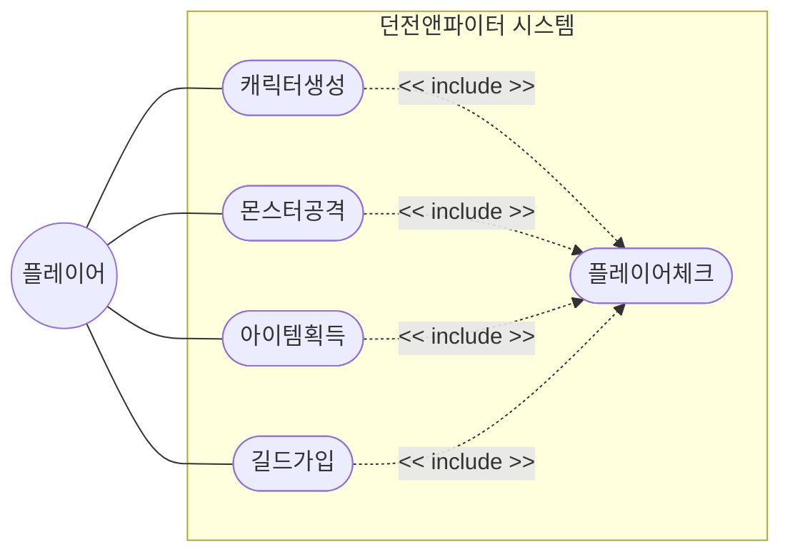

```mermaid
graph LR
    %% 액터 정의
    Actor((플레이어))

    %% 시스템 경계 (Use Cases)
    subgraph 던전앤파이터 시스템
        UC1([캐릭터생성])
        UC2([몬스터공격])
        UC3([아이템획득])
        UC4([길드가입])
        UC5([플레이어체크])
    end

    %% 액터와 유스케이스 간의 관계 (연관 관계)
    Actor --- UC1
    Actor --- UC2
    Actor --- UC3
    Actor --- UC4

    %% 유스케이스 간의 포함(Include) 관계
    UC1 -. "<< include >>" .-> UC5
    UC2 -. "<< include >>" .-> UC5
    UC3 -. "<< include >>" .-> UC5
    UC4 -. "<< include >>" .-> UC5
```