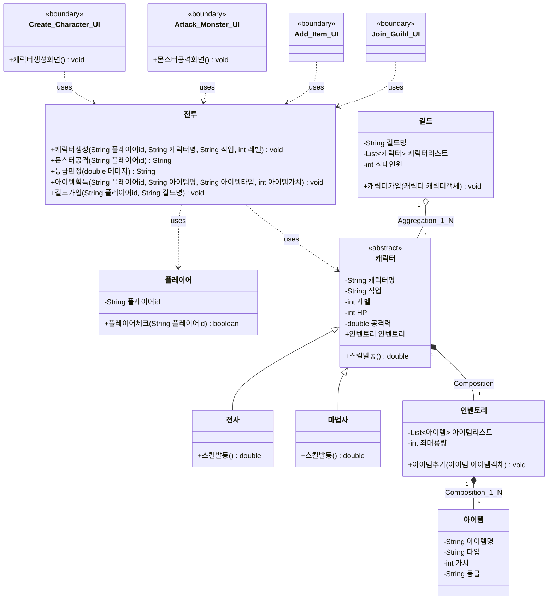

```mermaid
classDiagram
    %% UI (Boundary) 클래스
    class Create_Character_UI {
        <<boundary>>
        +캐릭터생성화면() void
    }
    class Attack_Monster_UI {
        <<boundary>>
        +몬스터공격화면() void
    }
    class Add_Item_UI {
        <<boundary>>
    }
    class Join_Guild_UI {
        <<boundary>>
    }

    %% 제어 클래스
    class 전투 {
        +캐릭터생성(String 플레이어id, String 캐릭터명, String 직업, int 레벨) void
        +몬스터공격(String 플레이어id) String
        +등급판정(double 데미지) String
        +아이템획득(String 플레이어id, String 아이템명, String 아이템타입, int 아이템가치) void
        +길드가입(String 플레이어id, String 길드명) void
    }

    %% 엔티티 클래스
    class 플레이어 {
        -String 플레이어id
        +플레이어체크(String 플레이어id) boolean
    }

    class 캐릭터 {
        <<abstract>>
        -String 캐릭터명
        -String 직업
        -int 레벨
        -int HP
        -double 공격력
        +인벤토리 인벤토리
        +스킬발동() double
    }

    class 전사 {
        +스킬발동() double
    }

    class 마법사 {
        +스킬발동() double
    }

    class 아이템 {
        -String 아이템명
        -String 타입
        -int 가치
        -String 등급
    }

    class 인벤토리 {
        -List~아이템~ 아이템리스트
        -int 최대용량
        +아이템추가(아이템 아이템객체) void
    }

    class 길드 {
        -String 길드명
        -List~캐릭터~ 캐릭터리스트
        -int 최대인원
        +캐릭터가입(캐릭터 캐릭터객체) void
    }

    %% 의존성 (Dependency) - uses 관계
    Create_Character_UI ..> 전투 : uses
    Attack_Monster_UI ..> 전투 : uses
    Add_Item_UI ..> 전투 : uses
    Join_Guild_UI ..> 전투 : uses

    전투 ..> 플레이어 : uses
    전투 ..> 캐릭터 : uses

    %% 상속 관계 (Generalization)
    캐릭터 <|-- 전사
    캐릭터 <|-- 마법사

    %% 복합객체 관계 (Composition & Aggregation)
    캐릭터 "1" *-- "1" 인벤토리 : Composition
    인벤토리 "1" *-- "*" 아이템 : Composition_1_N
    길드 "1" o-- "*" 캐릭터 : Aggregation_1_N
```