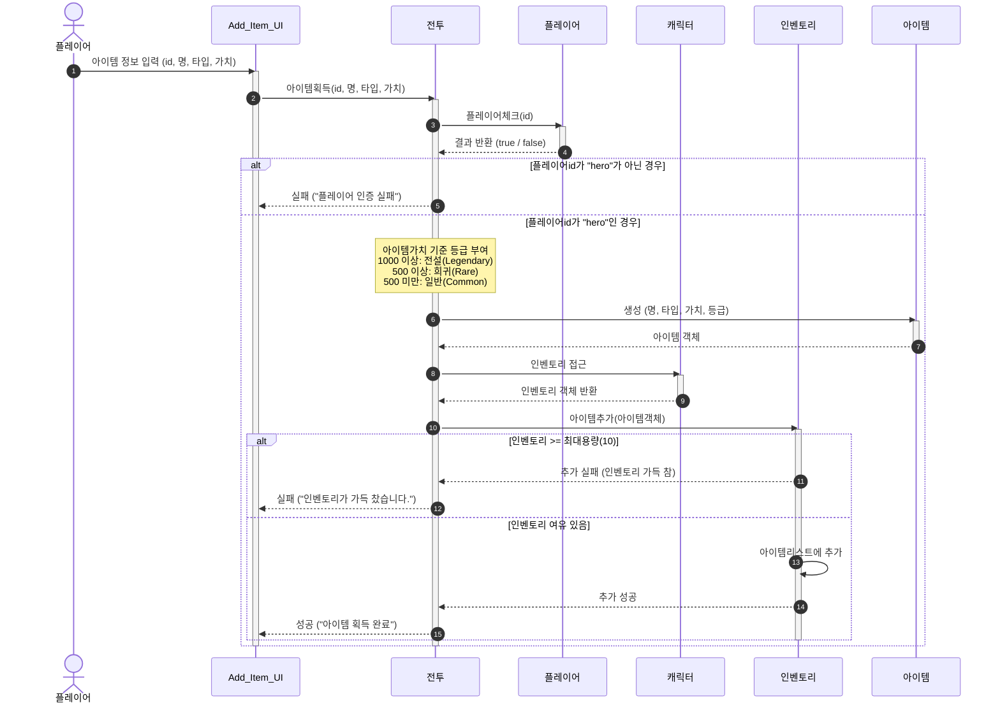

```mermaid
sequenceDiagram
    autonumber
    actor Player as 플레이어
    participant UI as Add_Item_UI
    participant Ctrl as 전투
    participant P as 플레이어
    participant C as 캐릭터
    participant Inv as 인벤토리
    participant Item as 아이템

    Player->>UI: 아이템 정보 입력 (id, 명, 타입, 가치)
    activate UI
    UI->>Ctrl: 아이템획득(id, 명, 타입, 가치)
    activate Ctrl
    
    Ctrl->>P: 플레이어체크(id)
    activate P
    P-->>Ctrl: 결과 반환 (true / false)
    deactivate P
    
    alt 플레이어id가 "hero"가 아닌 경우
        Ctrl-->>UI: 실패 ("플레이어 인증 실패")
    else 플레이어id가 "hero"인 경우
        
        Note over Ctrl: 아이템가치 기준 등급 부여<br/>1000 이상: 전설(Legendary)<br/>500 이상: 희귀(Rare)<br/>500 미만: 일반(Common)
        
        Ctrl->>Item: 생성 (명, 타입, 가치, 등급)
        activate Item
        Item-->>Ctrl: 아이템 객체
        deactivate Item
        
        Ctrl->>C: 인벤토리 접근
        activate C
        C-->>Ctrl: 인벤토리 객체 반환
        deactivate C
        
        Ctrl->>Inv: 아이템추가(아이템객체)
        activate Inv
        
        alt 인벤토리 >= 최대용량(10)
            Inv-->>Ctrl: 추가 실패 (인벤토리 가득 참)
            Ctrl-->>UI: 실패 ("인벤토리가 가득 찼습니다.")
        else 인벤토리 여유 있음
            Inv->>Inv: 아이템리스트에 추가
            Inv-->>Ctrl: 추가 성공
            Ctrl-->>UI: 성공 ("아이템 획득 완료")
        end
        deactivate Inv
        
    end
    
    deactivate Ctrl
    deactivate UI
```
